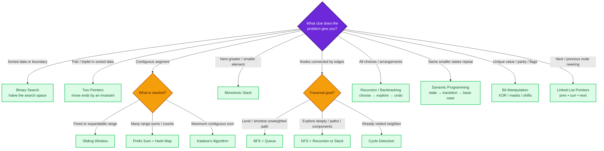
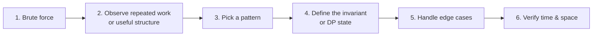

## 🧠 Visual DSA Mind Map

> Read this from top to bottom. Solid blue nodes have implementations in this repository; dashed gray nodes are on the roadmap.

```mermaid
flowchart TB
    DSA(("Data Structures<br/>& Algorithms"))

    DSA --> F["Foundations"]
    DSA --> L["Linear Structures"]
    DSA --> N["Hierarchical & Network"]
    DSA --> T["Problem-Solving Techniques"]

    F --> A["Arrays"]
    A --> A1["Basics → Search → Sort"]
    A --> A2["Prefix / Suffix"]
    A --> A3["Two Pointers"]
    A --> A4["Sliding Window"]
    A --> A5["Kadane & Subarrays"]
    A --> A6["Matrix / Grid"]

    F --> B["Bit Manipulation"]
    B --> B1["AND • OR • XOR • NOT"]
    B --> B2["Set • Clear • Toggle • Masks"]

    L --> LL["Linked Lists"]
    LL --> LL1["Singly • Doubly"]
    LL --> LL2["Fast / Slow Pointers"]
    LL --> LL3["Reverse • Merge • Delete"]

    L --> S["Stacks"]
    S --> S1["LIFO • Parentheses"]
    S --> S2["Monotonic Stack<br/>NGE / NSE"]
    L --> Q["Queues"]
    Q --> Q1["FIFO • Deque • BFS"]

    N --> TR["Trees"]
    TR --> TR1["DFS: Pre / In / Postorder"]
    TR --> TR2["BFS: Level Order"]
    TR --> TR3["Height • Balance • LCA • BST"]

    N --> G["Graphs"]
    G --> G1["Adjacency List / Matrix"]
    G --> G2["BFS • DFS"]
    G --> G3["Cycle Detection"]

    T --> R["Recursion"]
    R --> R1["Base Case + Smaller State"]
    T --> BT["Backtracking"]
    BT --> BT1["Choose → Explore → Undo"]
    T --> DP["Dynamic Programming"]
    DP --> DP1["Recursion → Memoization"]
    DP --> DP2["Tabulation → Space Optimization"]
    DP --> DP3["Pick / Not Pick • 1D • Grid"]

    classDef root fill:#6d28d9,color:#fff,stroke:#4c1d95,stroke-width:3px;
    classDef group fill:#0f766e,color:#fff,stroke:#134e4a,stroke-width:2px;
    classDef topic fill:#2563eb,color:#fff,stroke:#1e3a8a,stroke-width:2px;
    classDef pattern fill:#eff6ff,color:#172554,stroke:#93c5fd;
    classDef planned fill:#f8fafc,color:#64748b,stroke:#94a3b8,stroke-width:2px,stroke-dasharray:6 4;

    class DSA root;
    class F,L,N,T group;
    class A,B,LL,S,TR,G,R,DP topic;
    class A1,A2,A3,A4,A5,A6,B1,B2,LL1,LL2,LL3,S1,S2,TR1,TR2,TR3,G1,G2,G3,R1,DP1,DP2,DP3 pattern;
    class Q,Q1,BT,BT1 planned;
```

### 🔍 Pattern Recognition Map

Use the shape of the problem—not the topic name—to choose a pattern:

### ⚡ One Mental Model for Every Solution

---
